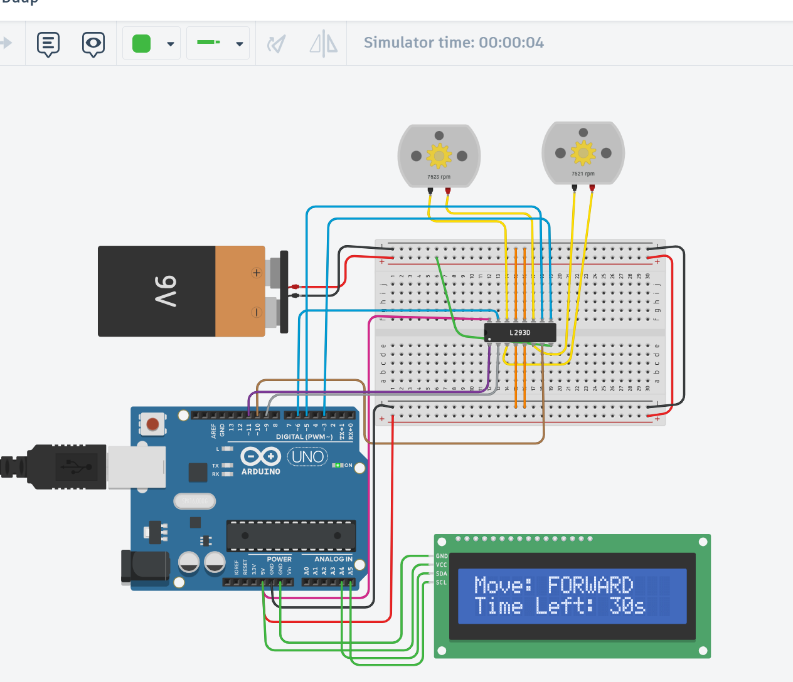
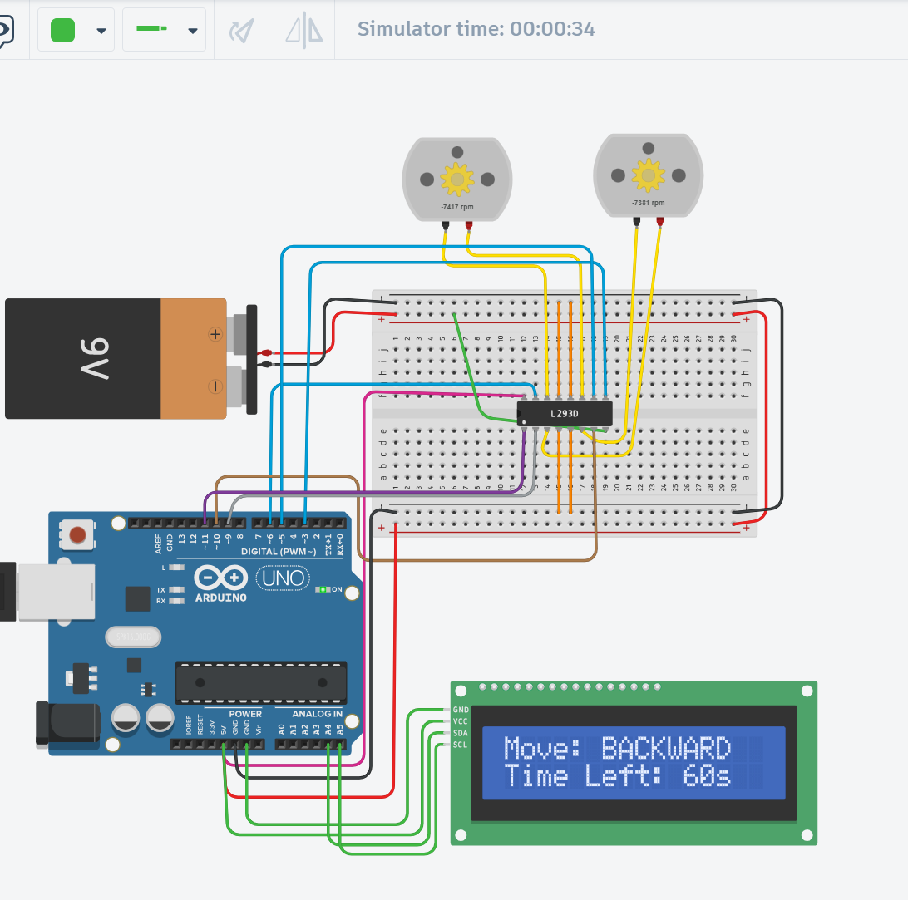
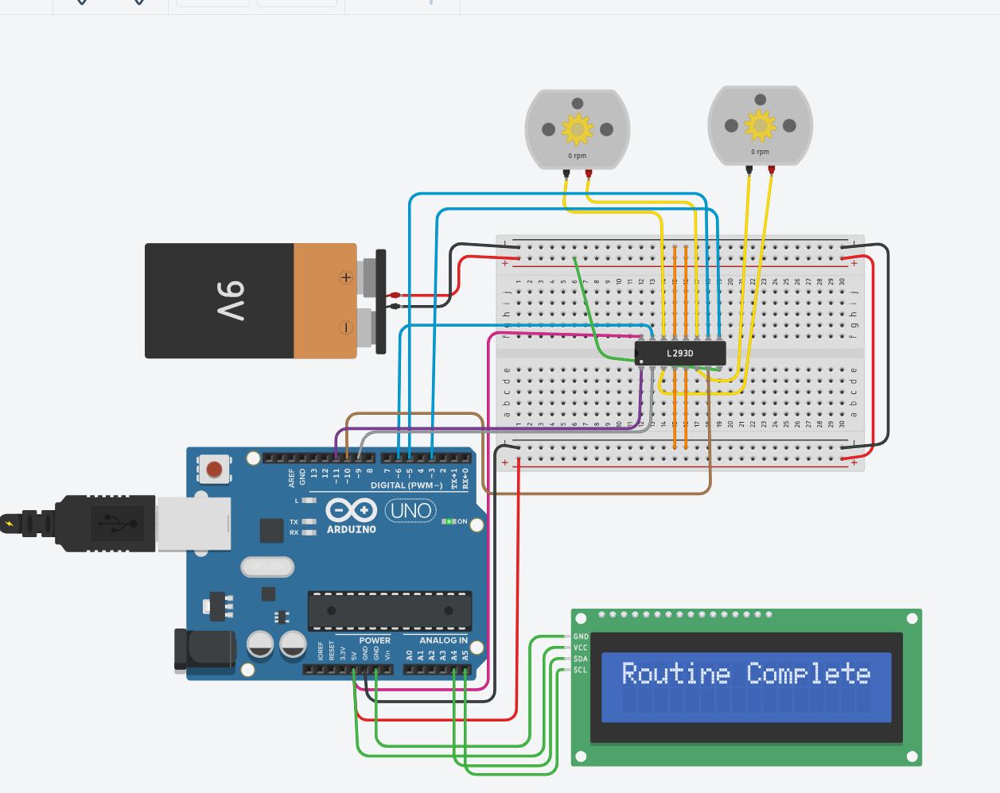

# ⚙️ Arduino DC Motor Control with LCD

## 🧠 Project Overview
I worked on controlling two DC motors using an L293D motor driver and an Arduino UNO.  
The system performs the following movements:
1. Forward for 30 seconds  
2. Backward for 60 seconds  
3. Alternates right and left for 1 minute  

An LCD screen displays the current movement during operation.

---

## 🔩 Components Used
- Arduino UNO  
- L293D / L298N Motor Driver  
- 2 × DC Motors  
- LCD 16x2 (I2C)  
- 9V Battery  
- Breadboard & Jumper Wires  

---

## 🔌 Circuit Images
| | |
|:--:|:--:|
|  | Moving Forward |
|  | Moving Backward |
|  | Routine Complete |
|  | Project Setup |

---

## 🧱 Simulation
You can view and test the full project on Tinkercad:  
👉 [**Open Tinkercad Simulation**]()

  
- Motors powered by a 9V battery  
- Tested and simulated using **Tinkercad Circuits**
